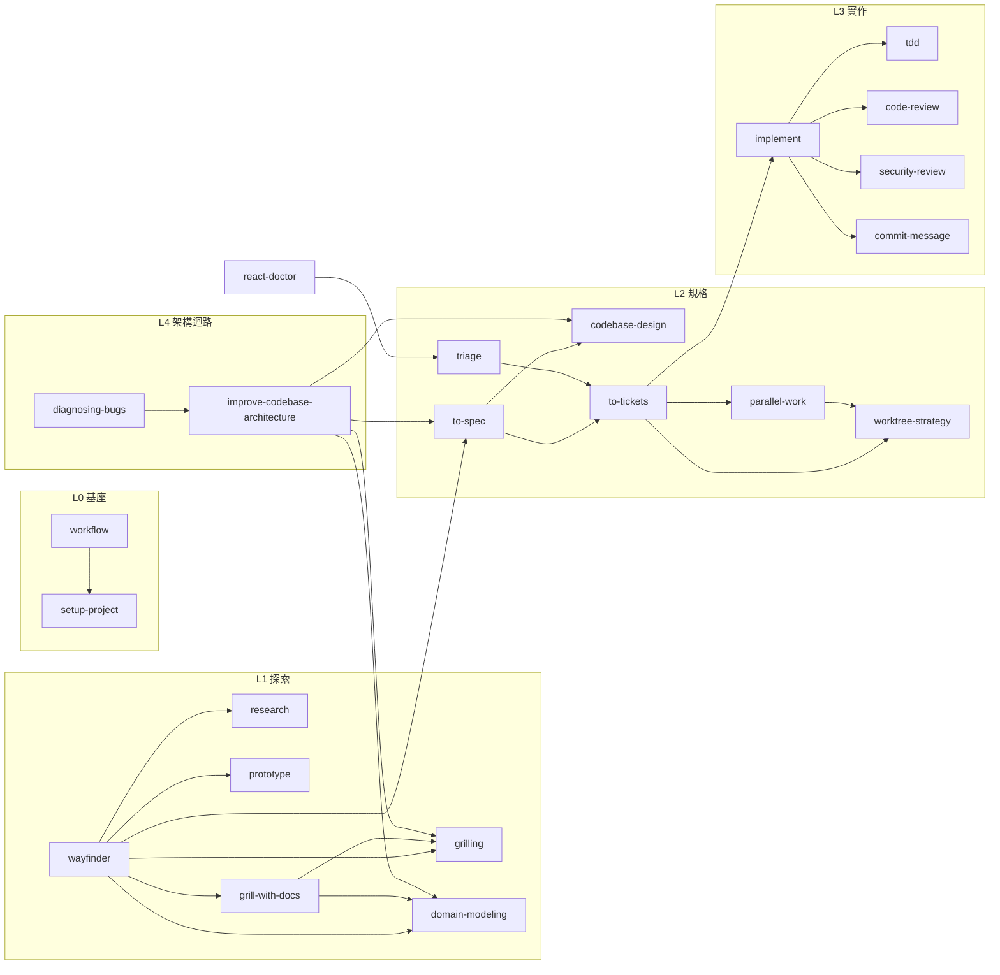

# `.claude/` 架構說明

這個資料夾是一套**可移植的工程 harness**：把「怎麼做工程」寫成 Claude Code 能載入的檔案。它與 SmartTrip FX 產品實作無關，可以整包複製到其他 repo。

> 這份文件解釋「本 repo 如何實作」，不是 Claude Code 官方功能的完整清單。第一次學習請先走 [`../CLAUDE-CODE.md`](../CLAUDE-CODE.md)，再用 [`../BUILD.md`](../BUILD.md) 完成 SmartTrip FX；官方另有 MCP、Plugins、Agent teams、Auto memory 等元件，本 repo 沒有為了展示而全部啟用。

```text
.claude/
├── README.md              # 本 repo 的 harness 架構參考
├── CLAUDE.template.md     # 搬到其他 repo 時使用的通用專案指令模板
├── settings.json          # 硬邊界：權限白/黑名單 + hook 註冊
├── hooks/                 # 機械閘門：工具呼叫前攔截（Python，非模型判斷）
│   ├── guard-bash.py
│   └── guard-write.py
├── rules/                 # 恆常紀律：每個 session 都套用的工作原則
│   └── engineering-workflow.md
├── skills/                # 程序知識：29 個「怎麼做某件事」的流程
│   └── <name>/SKILL.md [+ 附檔]
├── commands/              # skills 的單檔變體：2 個零判斷的機械 shortcut
│   ├── test.md
│   └── build-check.md
└── agents/                # 隔離工人：4 個獨立 context 的唯讀 subagent
    ├── code-explorer.md
    ├── security-reviewer.md
    ├── spec-reviewer.md
    └── standards-reviewer.md
```

---

## 1. 四層的分工

四個目錄不是平行的分類，而是**四種不同的執行責任**：

| 層 | 目錄 | 誰執行 | 控制性質 | 何時生效 |
|---|---|---|---|---|
| 工具閘門 | `settings.json` + `hooks/` | Claude Code runtime + Python | 在目前設定中做 deterministic 決策 | permission 判斷或工具呼叫前 |
| 恆常紀律 | `rules/` | 模型 | instruction，不是安全強制 | 本規則未設 `paths`，每個 session 載入 |
| 程序知識 | `skills/` | 模型 | 按需載入的 instruction | 被呼叫或符合情境時 |
| 隔離工人 | `agents/` | 獨立 subagent | 隔離 context 與工具範圍 | 被使用者或流程委派時 |

關鍵設計：**不可逆的風險放在 hooks，可判斷的品質放在 skills**。文字規則只能提醒，Python hook 才能真的擋下 `rm -rf ~`。

### settings.json 的三件事

```jsonc
{
  "includeGitInstructions": false,   // 關掉內建 git 指引，改用本 repo 的 skills
  "permissions": {
    "allow": [ /* 唯讀 git 與 rg：免確認，降低摩擦 */ ],
    "deny":  [ /* .env / *.pem / id_rsa* / secrets/**：連讀都不行 */ ]
  },
  "hooks": { "PreToolUse": [ /* Bash → guard-bash.py；Edit|Write → guard-write.py */ ] }
}
```

### hooks 的判斷

| Hook | 攔截點 | `deny`（直接擋） | `ask`（要求確認） |
|---|---|---|---|
| `guard-bash.py` | Bash | 用 shell 繞道讀 `.env` / `*.pem` / `id_rsa*` / `secrets/`；`rm -rf` 打到 `/`、`~`、`.`、`$CLAUDE_PROJECT_DIR` | 任何 `rm -rf`、`git reset --hard`、`git clean -f`、`git restore`、force push、`branch -D`、`stash drop`、`DROP TABLE`、`TRUNCATE` |
| `guard-write.py` | Edit / Write | 寫入真實 `.env` / `*.pem` / `id_rsa*` / `secrets/`；內容含 `sk-`、`sk-ant-`、`ghp_`、`AIza`、`AKIA`、PRIVATE KEY | — |

`deny` 的訊息一律指向替代做法（例：改寫 `.env.example`），不是單純拒絕。
`.env.example` / `.sample` / `.template` 白名單放行。

`guard-bash.py` 掃的是**路徑操作數**，不是整條指令的每個字：`git commit` 等訊息型子指令的 `-m` 內容、以及 heredoc 內容都視為文字，commit message 提到 `.env` 或私鑰不會被誤擋。例外是餵給 `bash`／`sh` 的 heredoc——那份內容會被當指令執行，照樣要掃。

倉庫根目錄的 `.githooks/` 是同一道防線的另一半：`.claude/hooks/` 管 Claude 的工具呼叫，`.githooks/` 管**人與任何 agent** 的 git 操作（pre-commit 擋 secret、pre-push 擋 main 的非快轉 push）。

### commands/：`skills/` 的單檔變體，不是第五層

官方文件已把 Custom commands 併入 skill 機制：`.claude/commands/<name>.md` 與 `.claude/skills/<name>/SKILL.md` 建立的是同一個 `/<name>`，差別只在單檔 vs 目錄（見 [`../CLAUDE-CODE.md`](../CLAUDE-CODE.md) 第 5 章「Commands 與 Output styles」）。本 repo 只在**零判斷、零副作用、不需要附檔**的情境才用單檔形式，目前是 `test`、`build-check` 兩個 Quality command 的直接 shortcut。凡是需要判斷（何時該用哪個 skill、要不要拆單）一律留在 `skills/`，不要把流程複製一份到 `commands/`。

---

## 2. 所有 skill 的共同介面：專案契約

這是整套設計的樞紐。29 個 skill、加上 `commands/` 的 2 個單檔 command，沒有一個硬編碼「測試指令是 `pytest`」，它們一律去讀同一份**專案契約**：Quality commands（focused/full test、typecheck、lint、format、build）、Issue tracker、Git workflow、Domain docs 位置、Risk boundary。

契約是一組**欄位**，不是一個固定檔案。落點有三個，依優先序：

```text
① docs/agents/project.md   ← /setup-project 產生；不隨 .claude/ 附帶，存在才用
② CLAUDE.md〈專案契約〉節   ← CLAUDE.template.md 自帶，小專案填這裡就夠
③ 從 repo 探索             ← 前兩者皆空時讀 CI 設定、manifest、既有 script
```

`.claude/` 內有 16 個檔案寫著「先讀 `docs/agents/project.md`」，那是①的路徑；`rules/engineering-workflow.md:7` 加了「（若存在）」作為全域降級，個別 skill 也各有 fallback（`to-spec:14` 安全推斷、`wayfinder:12` 改用 `.scratch/`、`implement:27` 未知命令不能猜）。**沒有①的 repo 一樣能跑**，只是每個 skill 要自己探索一次。

因此：
- 換一個 repo，`.claude/` 整包不用改，只需重填契約欄位。
- 任何一層都拿不到的欄位標 `unknown`，不得捏造命令。
- 「未驗證」與「已通過」的界線由它定義——只有契約列出的命令跑過才算數。

這個 repo 目前走②，沒有 `docs/` 目錄。何時該外移到①是**機械判斷**：契約欄位需要獨立版本控管、或多個 agent/CI 要引用同一份事實時。與專案內容無關。

---

## 3. `skills/` 分類

### 軸 A — 誰能啟動（frontmatter 決定）

| 模式 | frontmatter | 數量 | 成員 |
|---|---|---|---|
| **只有使用者能叫**（orchestration） | `disable-model-invocation: true` | 11 | `workflow` `setup-project` `wayfinder` `grill-with-docs` `to-spec` `to-tickets` `implement` `triage` `improve-codebase-architecture` `create-pull-request` `handoff` |
| **只有模型能叫**（內部紀律） | `user-invocable: false` | 1 | `grilling` |
| **兩者都可以**（discipline） | 無 | 17 | 其餘全部 |

為什麼要分：使用者專用的 skill 會**改變工作階段**（開始實作、發布 spec、建立 PR）。模型不能自己跳進去——否則一句「幫我看看」就變成自動開 PR。反之 `tdd`、`code-review` 這類純紀律，模型該用就用。

規則寫在 `CLAUDE.md`：*不要在使用者沒要求時自行啟動另一條 user-invoked workflow*。

### 軸 B — 功能分層

| 層 | Skills | 解決什麼 |
|---|---|---|
| **L0 基座** | `setup-project` `workflow` | 契約從哪來、現在該走哪條路 |
| **L1 探索與決策** | `wayfinder` `grill-with-docs` `grilling` `domain-modeling` `research` `prototype` | 還不知道要做什麼 |
| **L2 規格與切票** | `to-spec` `to-tickets` `triage` | 知道要做什麼，還沒切成可執行單位 |
| **L3 實作** | `implement` `tdd` `codebase-design` `improve-codebase-architecture` | 寫程式 |
| **L4 驗證** | `code-review` `security-review` `diagnosing-bugs` `react-doctor` | 證明它對 |
| **L5 Git 與交付** | `branch-name` `commit-message` `create-pull-request` `release-notes` `resolving-merge-conflicts` `worktree-strategy` `parallel-work` | 把成果送出去 |
| **L6 環境與 session** | `running-local-docker-stack` `handoff` `adhd-dev-mode` | 讓前面幾層跑得動 |

---

## 4. 呼叫關係

主線（`workflow/SKILL.md` 定義）：

```text
迷霧太大 ─▶ /wayfinder ─┐
                        ├─▶ /grill-with-docs ─▶ /to-spec ─▶ /to-tickets ─▶ /implement
需求已清楚 ─────────────┘                                        │
                                                                  ├─ tdd（每個 slice）
                                                                  ├─ code-review（收尾，必跑）
                                                                  └─ security-review（碰敏感面才跑）
```

完整的 skill → skill 引用圖（箭頭 = 前者在流程中指定使用後者）：



三個值得注意的性質：

1. **`workflow` 是唯一的全域索引**，它引用 22 個 skill 但沒有任何 skill 引用它——路由器不參與流程。
2. **`grilling` 是唯一的純被叫者**：`grill-with-docs`、`wayfinder`、`improve-codebase-architecture` 都靠它做「一次一題」的訪談迴圈，但它自己不能被使用者直接叫。這是刻意的——訪談紀律要嵌在有目的的流程裡，不是單獨一個聊天模式。
3. **`diagnosing-bugs → improve-codebase-architecture → codebase-design → to-spec` 形成回饋環**：修 bug 時發現的架構摩擦，會被導回規格階段，而不是就地擴大 diff。

---

## 5. 多檔 skill：附檔的三種角色

29 個 skill 中只有 3 個有附檔。SKILL.md 一旦觸發就整份進 context，所以**附檔存在的唯一理由是延後載入**——SKILL.md 只放「每次都要判斷的東西」，附檔放「走到那個分支才需要的東西」。

三個多檔 skill 剛好示範三種不同的附檔角色：

### A. 分支程序 — `codebase-design/`

```text
SKILL.md              共用詞彙（module / interface / depth / seam / adapter / leverage / locality）
   │                  + deletion test 等判斷準則           ← 每次都要
   ├── DESIGN-IT-TWICE.md   新 interface 時：產至少兩個結構不同的方案並比較
   └── DEEPENING.md         既有 cluster 時：畫 cluster → 選 seam → replace 不 layer → 保持綠燈
```

兩個附檔是**互斥分支**：要新建 interface 走前者，要改造既有程式走後者。SKILL.md 只負責判斷走哪邊。
`DESIGN-IT-TWICE.md` 還會再往下派工——把每個方案交給獨立 subagent，彼此看不到對方，避免趨同。

### B. 輸出模板 — `domain-modeling/`

```text
SKILL.md              訪談與收斂領域語言的紀律              ← 每次都要
   ├── CONTEXT-FORMAT.md    要寫 glossary 時的 CONTEXT.md 版型
   └── ADR-FORMAT.md        要寫 ADR 時的版型（含編號規則）
```

兩個附檔是**寫檔當下才需要的格式**，而且有明確門檻：ADR 只在「難逆轉 + 缺脈絡會令人意外 + 存在真實取捨」三條件同時成立時才提議。模板放外面，避免每次談領域都把兩份版型塞進 context。

### C. 判準範例 — `tdd/`

```text
SKILL.md              red → green → refactor 的執行順序與 seam 選擇   ← 每次都要
   ├── tests.md             好測試 vs 壞測試的對照範例（行為 vs 互動）
   └── mocking.md           可替換 / 不可替換的清單
```

兩個附檔都在回答同一個問題——「這個測試寫得對嗎」——但用**範例與清單**而非規則。這類內容篇幅大、只在爭議時需要，所以外置。

| 附檔角色 | 何時載入 | 例子 |
|---|---|---|
| 分支程序 | 判斷完走哪條路之後 | `DEEPENING.md` `DESIGN-IT-TWICE.md` |
| 輸出模板 | 真的要寫檔之前 | `CONTEXT-FORMAT.md` `ADR-FORMAT.md` |
| 判準範例 | 品質有爭議時 | `tests.md` `mocking.md` |

其餘 26 個 skill 都是單檔，因為它們的流程能在 15–60 行內講完。**附檔不是章節切分，是條件式載入**；如果一份附檔每次都會被讀，它就該併回 SKILL.md。

---

## 6. `agents/`：把 context 汙染隔離出去

本 repo 的 4 個 agent 全部是 `tools: Read, Glob, Grep, Bash` + `disallowedTools: Write, Edit, NotebookEdit` + `permissionMode: plan`——**依目前設定一律唯讀**。

| Agent | 被誰呼叫 | 職責 | 輸出上限 |
|---|---|---|---|
| `code-explorer` | `improve-codebase-architecture` | 定位實作、呼叫關係、設定與測試 | 20 行 |
| `standards-reviewer` | `code-review` | repo 標準、程式異味、測試品質 | 5 項 |
| `spec-reviewer` | `code-review` | 漏做、做錯、scope creep | 5 項 |
| `security-reviewer` | `security-review`、`code-review`（碰敏感面時） | 入口 → 路徑 → 影響的攻擊路徑 | 5 項 |

兩個設計重點：

**雙軸互不可見。** `code-review` 在同一則訊息平行呼叫 `standards-reviewer` 與 `spec-reviewer`，兩者看不到對方輸出，聚合時分開呈現、各自保留嚴重度排序，不跨軸選單一冠軍。理由：合併會讓一軸的「通過」洗掉另一軸的問題。Security 也不併進前兩軸。

**agent 可以掛 skill。** `standards-reviewer` 的 frontmatter 有 `skills: [codebase-design]`，讓它用同一套 deep-module 詞彙審查，而不是自創說法。這是 agents 與 skills 唯一的反向連結。

---

## 7. 讀取順序（一個 session 的實際生命週期）

```text
session 啟動
  ├─ CLAUDE.md（專案）+ ~/.claude/CLAUDE.md（全域）  常駐
  ├─ .claude/rules/engineering-workflow.md            常駐
  └─ settings.json → 註冊 hooks、套用權限
        │
使用者輸入 ─▶ 模型判斷是否需要 skill
        ├─ 使用者打 /implement  ──▶ 載入 skills/implement/SKILL.md
        │        └─ 流程指向 tdd ──▶ 載入 skills/tdd/SKILL.md
        │                └─ mock 有爭議 ──▶ 載入 tdd/mocking.md
        └─ 流程指向 code-review ─▶ 平行派出 standards-reviewer + spec-reviewer（獨立 context）
        │
任何工具呼叫 ─▶ PreToolUse hook 先判 allow / ask / deny
```

`CLAUDE.md`（薄、常駐）→ `rules/`（薄、常駐）→ `skills/`（厚、按需）→ 附檔（更厚、更按需）是同一個梯度：**常駐的東西必須短**。

---

## 8. 移植到其他 repo

```bash
cp -r .claude/{settings.json,hooks,rules,skills,commands,agents} <target-repo>/.claude/
cp .claude/CLAUDE.template.md <target-repo>/CLAUDE.md
cd <target-repo> && claude
```

複製完就能用。填〈專案契約〉節是第一件事，可以手填，也可以跑 `/setup-project` 由它探索後外移成 `docs/agents/project.md`——**兩者等價，`/setup-project` 不是前置條件**。

整包沒有任何 SmartTrip FX 或 Python 專屬內容；`react-doctor` 與 `running-local-docker-stack` 用不到就留著，模型不會在無關情境啟動它們。

通用版 CLAUDE.md 見 [`CLAUDE.template.md`](./CLAUDE.template.md)；本 repo 根目錄的 `CLAUDE.md` 是它加上教材專屬約束後的版本。
